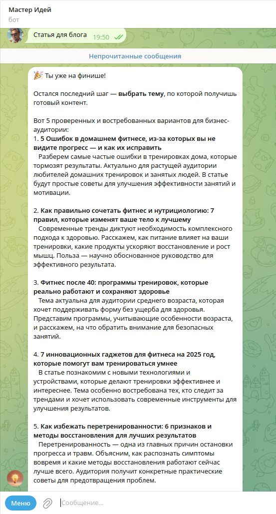
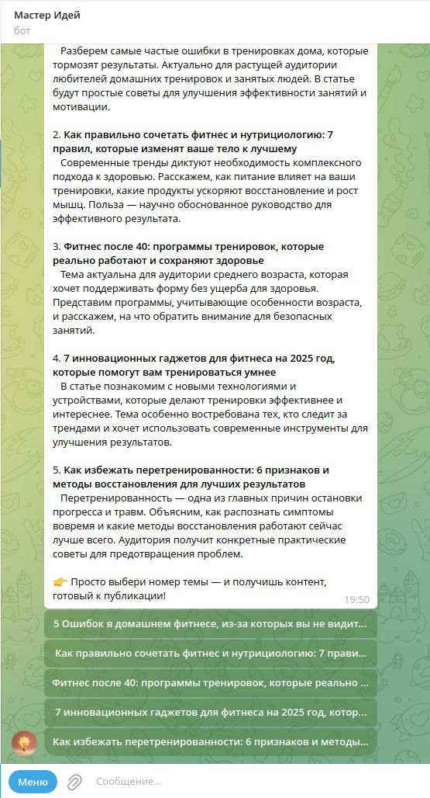
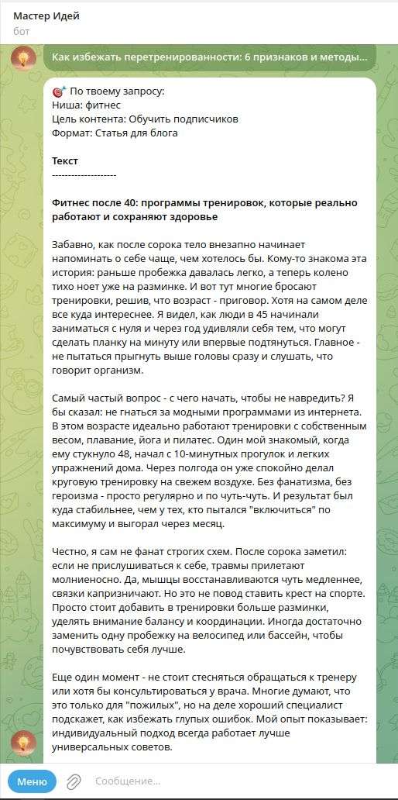
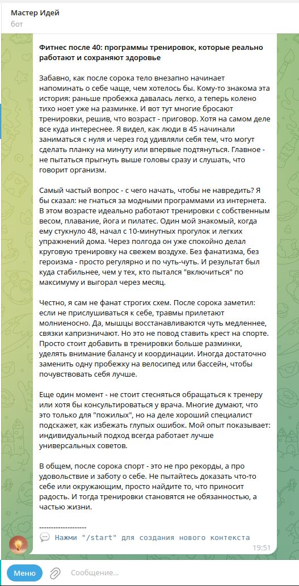
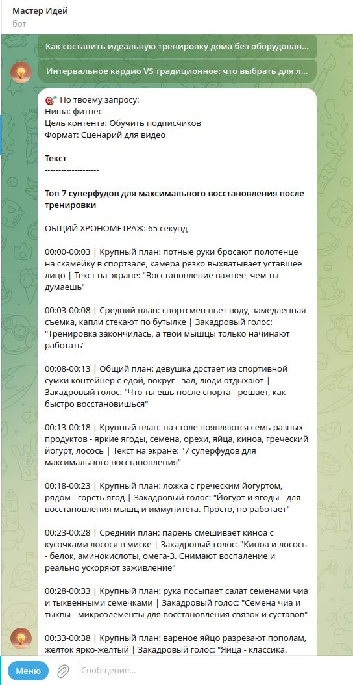
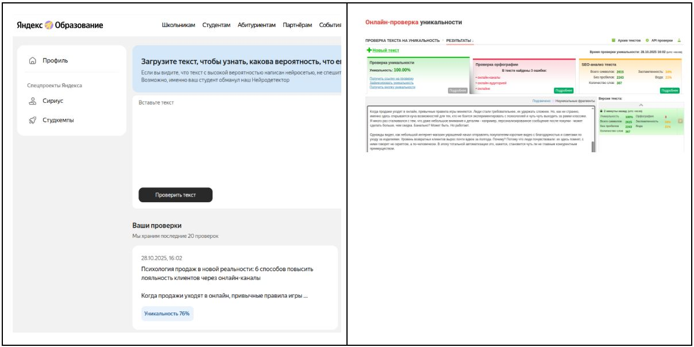
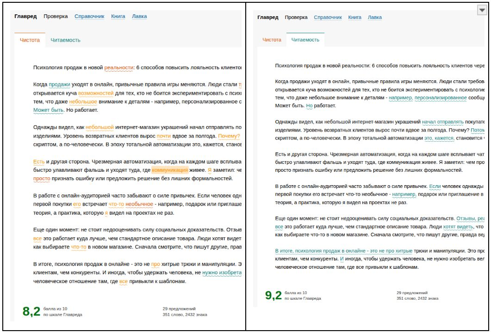
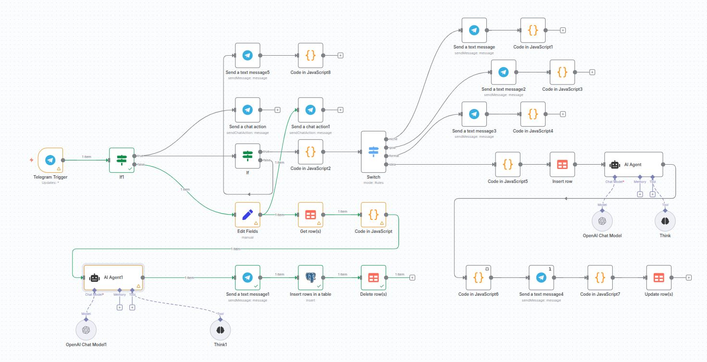

# Masters of Ideas
***Описание скриншотов для "AI-помощника для генерации контента***

--- 

[⬅️ Вернуться к описанию проекта](../README.md)

---

## Интерфейс в телеграмм

1.  

🟢 Запуск бота и запрос информации у пользователя — начало взаимодействия и сбор данных для формирования контекста.

2.  

💡 Отображение 5 сгенерированных актуальных тем с цепляющими заголовками — ключевой этап для быстрого выбора направления.

3.  

🔘 Интерактивные кнопки выбора в Telegram — удобство навигации и управления процессом без лишних команд.

4.  

📄 Готовый пост, созданный ботом — итог работы искусственного интеллекта с естественным стилем.

5.  

🔄 Запуск создания нового поста — возможность быстро повторить процесс для свежего контента.

6. 

✨ При выборе "Сценарий видеоролика". Пользователь получает готовый к съёмке сценарий с ⏱️ таймкодами, 🎬 визуальными указаниями и 📝 текстом — без ручной доработки.

--- 

## Качество сгенерированного текста

6.  

✔️ Проверка уникальности текста и его естественности — гарантия качества и аутентичности.

7.  

📊 Анализ текста с помощью Главреда — улучшение читаемости и стиля.

--- 

## Рабочий процесс

8.  

🔄 Визуализация рабочего процесса — демонстрация структуры и этапов работы бота для понимания архитектуры проекта.

--- 

[⬅️ Вернуться к описанию проекта](../README.md)
